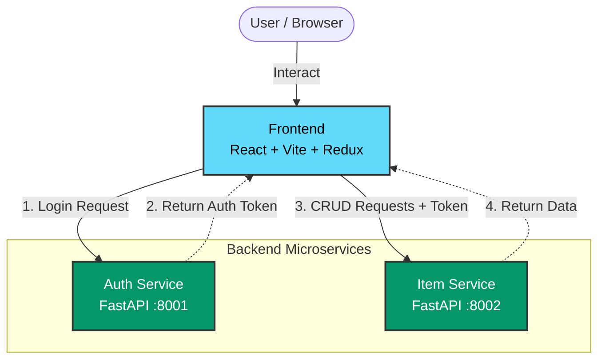

# FastAPI React Auth CRUD

A full-stack application built with FastAPI (backend services) and React (frontend), demonstrating a microservices architecture with built-in authentication and CRUD operations.

## Architecture Overview

The system consists of a dynamic React frontend and two independent FastAPI backend services:
- **Auth Service**: Handles user authentication, token issuance, and validation.
- **Item Service**: Manages resource-specific CRUD operations, validating authentication tokens for protected routes.



## Features

- **Frontend**: React application bundled with Vite, featuring state management with Redux.
- **Microservices Backend**: Two Python FastAPI services providing highly performant and auto-documented APIs.
- **Authentication**: OAuth2-styled login flow with token-based authorization.
- **Containerization**: Fully Dockerized services ready to be orchestrated via `docker-compose`.
- **Orchestration & CI/CD**: Includes configurations setup for Kubernetes (`/k8s`) deployment and a Jenkins continuous integration pipeline (`Jenkinsfile`).

## Getting Started

### Running Locally with Docker

**Prerequisites**: Ensure you have [Docker](https://www.docker.com/) and [Docker Compose](https://docs.docker.com/compose/) installed on your machine.

1. In the root directory of the project, run the following command to build and start all containers:
   ```bash
   docker-compose up --build
   ```
2. Once the containers are up and running, you can access the application components:
   - **Frontend Application**: `http://localhost:5173`
   - **Auth Service API Docs (Swagger)**: `http://localhost:8001/docs`
   - **Item Service API Docs (Swagger)**: `http://localhost:8002/docs`

## Directory Structure

- `/frontend` - React application source code.
- `/services/auth-service` - FastAPI authentication service for user login.
- `/services/item-service` - FastAPI CRUD service for managing items.
- `/k8s` - Kubernetes manifest files for cluster deployment.
- `docker-compose.yml` - Docker Compose configuration for local development.
- `Jenkinsfile` - Jenkins pipeline script for continuous integration and deployment.
