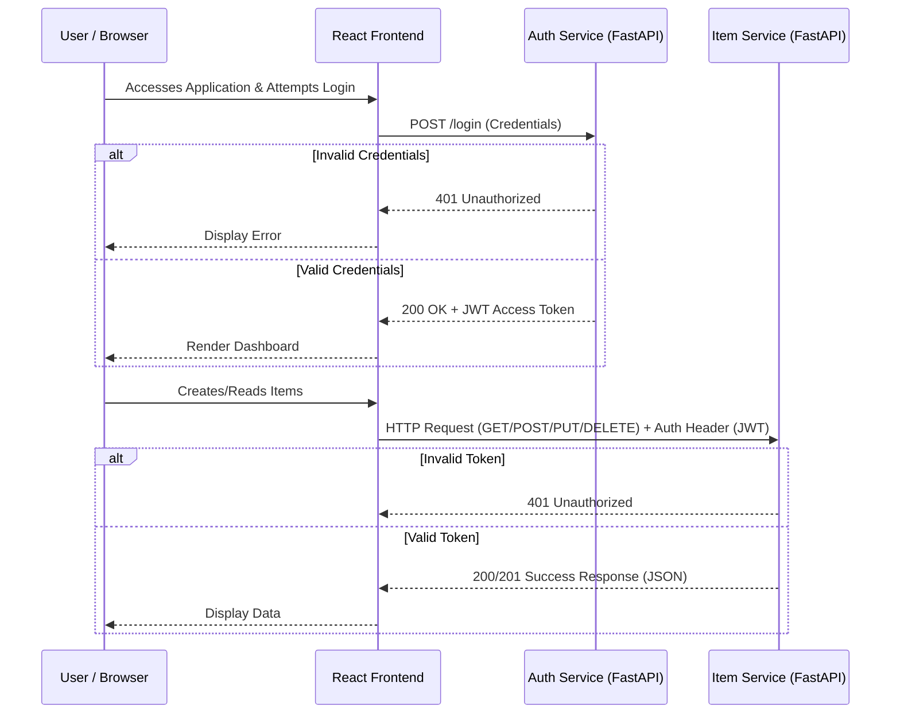
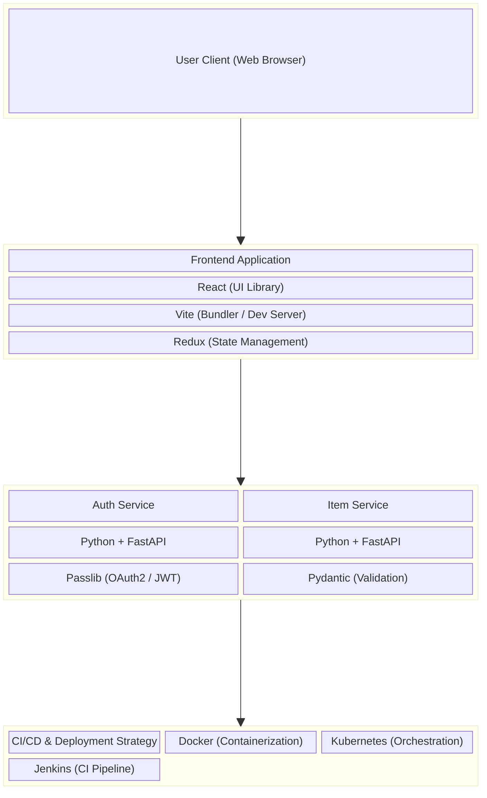
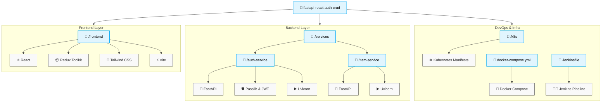

# Project Wiki: FastAPI React Auth CRUD

Welcome to the project wiki! This document provides an in-depth overview of the application's architecture, the tools involved, and how you can deploy and run it both locally and in a production-like environment.

## 1. Application Flow Diagram

The following diagram illustrates how a user request (such as a login or CRUD action) flows through the system's microservices.



## 2. Tools & Tech Stack Diagram

This diagram visualizes the tools and technologies used to build, manage, and deploy the application.



---

## 3. Tool Directory Mapping

This diagram maps the primary tools and technologies explicitly to the directory structure where they are configured and utilized.



---

## 4. How to Deploy and Run the Application

There are multiple ways to run and deploy this application depending on your needs. For development, `docker-compose` is highly recommended. For production equivalents, we provide Kubernetes manifests.

### Option A: Local Development (Docker Compose)

The easiest way to run the entire stack is using Docker Compose. Make sure [Docker](https://docs.docker.com/get-docker/) is running on your machine.

**Steps:**
1. Open a terminal in the root directory of the project.
2. Build and start the containers:
   ```bash
   docker-compose up --build
   ```
3. Wait for the containers to initialize.
4. The services are now available at:
   - **Frontend UI:** `http://localhost:5173`
   - **Auth Service:** `http://localhost:8001`
     - **Swagger UI (Docs):** `http://localhost:8001/docs`
   - **Item Service:** `http://localhost:8002`
     - **Swagger UI (Docs):** `http://localhost:8002/docs`

To stop the containers, press `Ctrl+C` or run:
```bash
docker-compose down
```

### Option B: Kubernetes Deployment (Minikube / Cluster)

The `/k8s` directory contains standard Kubernetes resources (Deployments, Services, and optionally an Ingress). Ensure you have a cluster running (e.g., Minikube).

**Steps:**
1. Ensure your Kubernetes cluster is running:
   ```bash
   minikube start
   ```
2. Build the Docker images inside your Kubernetes environment (if using Minikube):
   ```bash
   eval $(minikube docker-env)
   docker build -t frontend:latest ./frontend
   docker build -t auth-service:latest ./services/auth-service
   docker build -t item-service:latest ./services/item-service
   ```
3. Apply the Kubernetes configuration files:
   ```bash
   kubectl apply -f k8s/deployments.yaml
   kubectl apply -f k8s/services.yaml
   kubectl apply -f k8s/ingress.yaml
   ```
4. Check the status of your pods to ensure they are `Running`:
   ```bash
   kubectl get pods
   ```
5. You can port-forward the services or access them via the Ingress (if configured and supported by your cluster environment).

### Option C: Continuous Integration (Jenkins)

The project includes a `Jenkinsfile`. If you have a Jenkins server set up:
1. Create a new Pipeline project pointing to this repository.
2. The pipeline handles:
   - Defining parallel stages for Frontend and Backend API builds.
   - Pushing Docker images.
   - Setting up deployment to environments (configurable inside the script).
